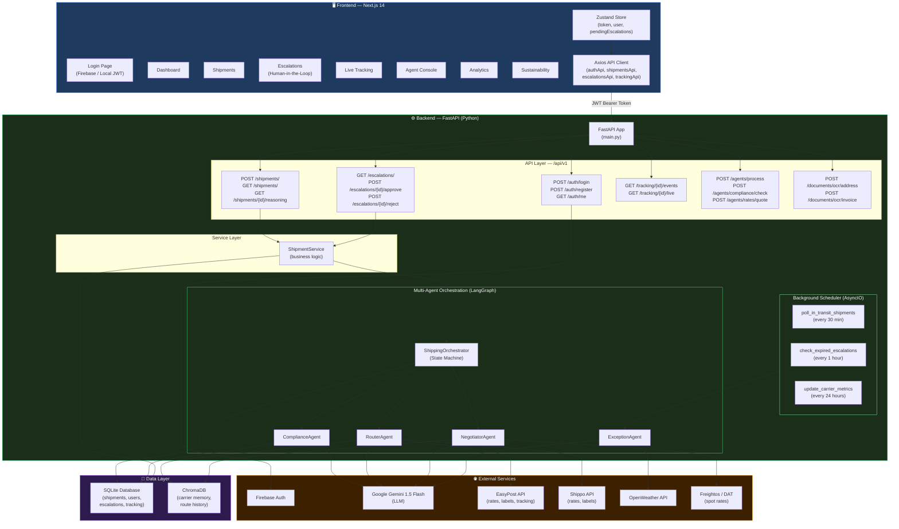

# System Architecture Overview

```mermaid
graph TB
    subgraph CLIENT["🖥️ Frontend — Next.js 14"]
        direction TB
        UI_LOGIN["Login Page\n(Firebase / Local JWT)"]
        UI_DASH["Dashboard"]
        UI_SHIP["Shipments"]
        UI_ESC["Escalations\n(Human-in-the-Loop)"]
        UI_TRACK["Live Tracking"]
        UI_AGENT["Agent Console"]
        UI_ANA["Analytics"]
        UI_SUS["Sustainability"]
        STORE["Zustand Store\n(token, user, pendingEscalations)"]
        API_CLIENT["Axios API Client\n(authApi, shipmentsApi,\nescalationsApi, trackingApi)"]
    end

    subgraph BACKEND["⚙️ Backend — FastAPI (Python)"]
        direction TB
        FASTAPI["FastAPI App\n(main.py)"]
        
        subgraph API_LAYER["API Layer — /api/v1"]
            R_AUTH["POST /auth/login\nPOST /auth/register\nGET /auth/me"]
            R_SHIP["POST /shipments/\nGET /shipments/\nGET /shipments/{id}/reasoning"]
            R_ESC["GET /escalations/\nPOST /escalations/{id}/approve\nPOST /escalations/{id}/reject"]
            R_TRACK["GET /tracking/{id}/events\nGET /tracking/{id}/live"]
            R_AGENT["POST /agents/process\nPOST /agents/compliance/check\nPOST /agents/rates/quote"]
            R_DOC["POST /documents/ocr/address\nPOST /documents/ocr/invoice"]
        end

        subgraph SERVICE_LAYER["Service Layer"]
            SVC["ShipmentService\n(business logic)"]
        end

        subgraph AGENT_LAYER["Multi-Agent Orchestration (LangGraph)"]
            ORCH["ShippingOrchestrator\n(State Machine)"]
            CA["ComplianceAgent"]
            RA["RouterAgent"]
            NA["NegotiatorAgent"]
            EA["ExceptionAgent"]
        end

        subgraph SCHEDULER["Background Scheduler (AsyncIO)"]
            T1["poll_in_transit_shipments\n(every 30 min)"]
            T2["check_expired_escalations\n(every 1 hour)"]
            T3["update_carrier_metrics\n(every 24 hours)"]
        end
    end

    subgraph DATA["💾 Data Layer"]
        SQLITE["SQLite Database\n(shipments, users,\nescalations, tracking)"]
        CHROMA["ChromaDB\n(carrier memory,\nroute history)"]
    end

    subgraph EXTERNAL["🌐 External Services"]
        FIREBASE["Firebase Auth"]
        GEMINI["Google Gemini 1.5 Flash\n(LLM)"]
        EASYPOST["EasyPost API\n(rates, labels, tracking)"]
        SHIPPO["Shippo API\n(rates, labels)"]
        WEATHER["OpenWeather API"]
        FREIGHTOS["Freightos / DAT\n(spot rates)"]
    end

    %% Frontend → Backend
    API_CLIENT -->|"JWT Bearer Token"| FASTAPI
    STORE --> API_CLIENT

    %% API → Service
    R_SHIP --> SVC
    R_ESC --> SVC
    FASTAPI --> R_AUTH
    FASTAPI --> R_SHIP
    FASTAPI --> R_ESC
    FASTAPI --> R_TRACK
    FASTAPI --> R_AGENT
    FASTAPI --> R_DOC

    %% Service → Agents
    SVC --> ORCH
    ORCH --> CA
    ORCH --> RA
    ORCH --> NA
    SCHEDULER --> EA

    %% Agents → Data
    ORCH --> SQLITE
    CA --> SQLITE
    RA --> CHROMA
    NA --> CHROMA

    %% Agents → External
    CA --> GEMINI
    RA --> GEMINI
    NA --> GEMINI
    EA --> GEMINI
    RA --> EASYPOST
    RA --> SHIPPO
    NA --> FREIGHTOS
    EA --> WEATHER
    R_AUTH --> FIREBASE

    %% Service → Data
    SVC --> SQLITE

    style CLIENT fill:#1e3a5f,stroke:#3b82f6,color:#fff
    style BACKEND fill:#1a2e1a,stroke:#22c55e,color:#fff
    style DATA fill:#2d1b4e,stroke:#a855f7,color:#fff
    style EXTERNAL fill:#3d2000,stroke:#f59e0b,color:#fff
    style AGENT_LAYER fill:#1a2e1a,stroke:#4ade80,color:#fff
    style SCHEDULER fill:#1a2e1a,stroke:#86efac,color:#fff
```
