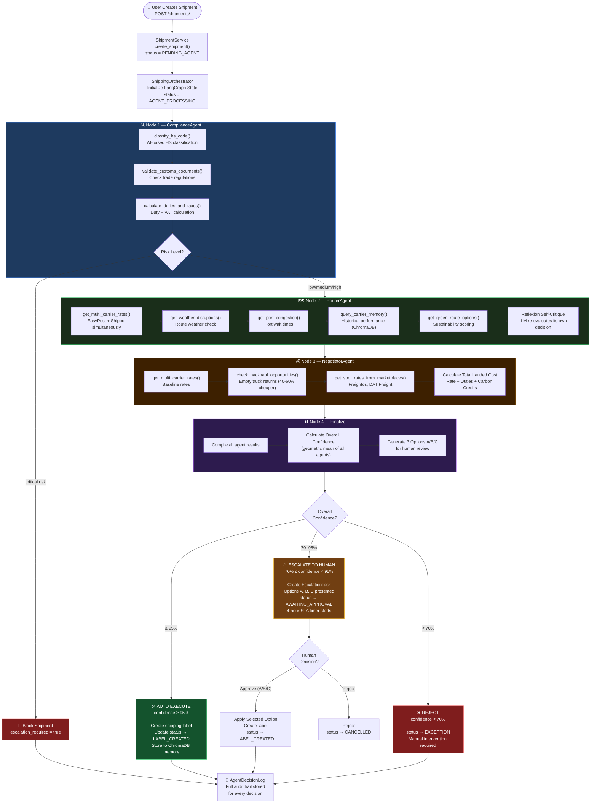

# Agent Workflow — LangGraph State Machine

```mermaid
flowchart TD
    START(["🚀 User Creates Shipment\nPOST /shipments/"])
    
    CREATE["ShipmentService\ncreate_shipment()\nstatus = PENDING_AGENT"]
    
    ORCH["ShippingOrchestrator\nInitialize LangGraph State\nstatus = AGENT_PROCESSING"]

    subgraph COMPLIANCE_NODE["🔍 Node 1 — ComplianceAgent"]
        C1["classify_hs_code()\nAI-based HS classification"]
        C2["validate_customs_documents()\nCheck trade regulations"]
        C3["calculate_duties_and_taxes()\nDuty + VAT calculation"]
        C4{"Risk Level?"}
        C1 --> C2 --> C3 --> C4
    end

    subgraph ROUTING_NODE["🗺️ Node 2 — RouterAgent"]
        R1["get_multi_carrier_rates()\nEasyPost + Shippo simultaneously"]
        R2["get_weather_disruptions()\nRoute weather check"]
        R3["get_port_congestion()\nPort wait times"]
        R4["query_carrier_memory()\nHistorical performance (ChromaDB)"]
        R5["get_green_route_options()\nSustainability scoring"]
        R6["Reflexion Self-Critique\nLLM re-evaluates its own decision"]
        R1 --> R2 --> R3 --> R4 --> R5 --> R6
    end

    subgraph NEGOTIATION_NODE["💰 Node 3 — NegotiatorAgent"]
        N1["get_multi_carrier_rates()\nBaseline rates"]
        N2["check_backhaul_opportunities()\nEmpty truck returns (40-60% cheaper)"]
        N3["get_spot_rates_from_marketplaces()\nFreightos, DAT Freight"]
        N4["Calculate Total Landed Cost\nRate + Duties + Carbon Credits"]
        N1 --> N2 --> N3 --> N4
    end

    subgraph FINALIZE_NODE["📊 Node 4 — Finalize"]
        F1["Compile all agent results"]
        F2["Calculate Overall Confidence\n(geometric mean of all agents)"]
        F3["Generate 3 Options A/B/C\nfor human review"]
        F1 --> F2 --> F3
    end

    CONFIDENCE{"Overall\nConfidence?"}

    AUTO["✅ AUTO EXECUTE\nconfidence ≥ 95%\n\nCreate shipping label\nUpdate status → LABEL_CREATED\nStore to ChromaDB memory"]

    ESCALATE["⚠️ ESCALATE TO HUMAN\n70% ≤ confidence < 95%\n\nCreate EscalationTask\nOptions A, B, C presented\nstatus → AWAITING_APPROVAL\n4-hour SLA timer starts"]

    REJECT["❌ REJECT\nconfidence < 70%\n\nstatus → EXCEPTION\nManual intervention required"]

    HUMAN{"Human\nDecision?"}
    APPLY["Apply Selected Option\nCreate label\nstatus → LABEL_CREATED"]
    REJECT2["Reject\nstatus → CANCELLED"]

    LOG["📝 AgentDecisionLog\nFull audit trail stored\nfor every decision"]

    START --> CREATE --> ORCH
    ORCH --> COMPLIANCE_NODE
    C4 -->|"critical risk"| BLOCK["🚫 Block Shipment\nescalation_required = true"]
    C4 -->|"low/medium/high"| ROUTING_NODE
    ROUTING_NODE --> NEGOTIATION_NODE
    NEGOTIATION_NODE --> FINALIZE_NODE
    FINALIZE_NODE --> CONFIDENCE

    CONFIDENCE -->|"≥ 95%"| AUTO
    CONFIDENCE -->|"70–95%"| ESCALATE
    CONFIDENCE -->|"< 70%"| REJECT

    ESCALATE --> HUMAN
    HUMAN -->|"Approve (A/B/C)"| APPLY
    HUMAN -->|"Reject"| REJECT2

    AUTO --> LOG
    APPLY --> LOG
    REJECT --> LOG
    BLOCK --> LOG

    style COMPLIANCE_NODE fill:#1e3a5f,stroke:#3b82f6,color:#fff
    style ROUTING_NODE fill:#1a2e1a,stroke:#22c55e,color:#fff
    style NEGOTIATION_NODE fill:#3d2000,stroke:#f59e0b,color:#fff
    style FINALIZE_NODE fill:#2d1b4e,stroke:#a855f7,color:#fff
    style AUTO fill:#14532d,stroke:#4ade80,color:#fff
    style ESCALATE fill:#713f12,stroke:#fbbf24,color:#fff
    style REJECT fill:#7f1d1d,stroke:#f87171,color:#fff
    style BLOCK fill:#7f1d1d,stroke:#f87171,color:#fff
```
