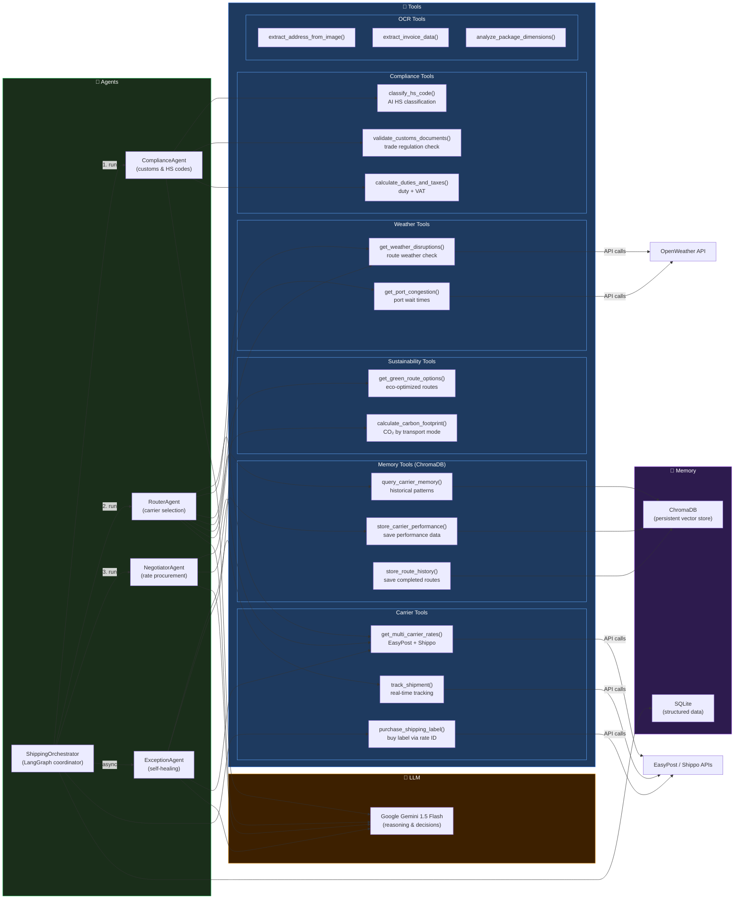

# Agent Interactions & Tool Usage

```mermaid
graph LR
    subgraph AGENTS["🤖 Agents"]
        ORCH["ShippingOrchestrator\n(LangGraph coordinator)"]
        CA["ComplianceAgent\n(customs & HS codes)"]
        RA["RouterAgent\n(carrier selection)"]
        NA["NegotiatorAgent\n(rate procurement)"]
        EA["ExceptionAgent\n(self-healing)"]
    end

    subgraph TOOLS["🔧 Tools"]
        subgraph CARRIER_TOOLS["Carrier Tools"]
            T_RATES["get_multi_carrier_rates()\nEasyPost + Shippo"]
            T_LABEL["purchase_shipping_label()\nbuy label via rate ID"]
            T_TRACK["track_shipment()\nreal-time tracking"]
        end

        subgraph COMPLIANCE_TOOLS["Compliance Tools"]
            T_HS["classify_hs_code()\nAI HS classification"]
            T_DOCS["validate_customs_documents()\ntrade regulation check"]
            T_DUTY["calculate_duties_and_taxes()\nduty + VAT"]
        end

        subgraph MEMORY_TOOLS["Memory Tools (ChromaDB)"]
            T_STORE["store_carrier_performance()\nsave performance data"]
            T_QUERY["query_carrier_memory()\nhistorical patterns"]
            T_ROUTE["store_route_history()\nsave completed routes"]
        end

        subgraph SUSTAINABILITY_TOOLS["Sustainability Tools"]
            T_CARBON["calculate_carbon_footprint()\nCO₂ by transport mode"]
            T_GREEN["get_green_route_options()\neco-optimized routes"]
        end

        subgraph WEATHER_TOOLS["Weather Tools"]
            T_WEATHER["get_weather_disruptions()\nroute weather check"]
            T_PORT["get_port_congestion()\nport wait times"]
        end

        subgraph OCR_TOOLS["OCR Tools"]
            T_ADDR["extract_address_from_image()"]
            T_INV["extract_invoice_data()"]
            T_PKG["analyze_package_dimensions()"]
        end
    end

    subgraph LLM["🧠 LLM"]
        GEMINI["Google Gemini 1.5 Flash\n(reasoning & decisions)"]
    end

    subgraph MEMORY["💾 Memory"]
        CHROMA["ChromaDB\n(persistent vector store)"]
        SQLITE["SQLite\n(structured data)"]
    end

    %% Orchestrator controls agents
    ORCH -->|"1. run"| CA
    ORCH -->|"2. run"| RA
    ORCH -->|"3. run"| NA
    ORCH -->|"async"| EA

    %% Agent → Tools
    CA --> T_HS
    CA --> T_DOCS
    CA --> T_DUTY

    RA --> T_RATES
    RA --> T_WEATHER
    RA --> T_PORT
    RA --> T_QUERY
    RA --> T_GREEN
    RA --> T_CARBON

    NA --> T_RATES
    NA --> T_STORE

    EA --> T_TRACK
    EA --> T_WEATHER
    EA --> T_RATES

    ORCH --> T_LABEL

    %% Tools → External
    T_RATES -->|"API calls"| EXT_CARRIER["EasyPost / Shippo APIs"]
    T_TRACK -->|"API calls"| EXT_CARRIER
    T_LABEL -->|"API calls"| EXT_CARRIER
    T_WEATHER -->|"API calls"| EXT_WEATHER["OpenWeather API"]
    T_PORT -->|"API calls"| EXT_WEATHER

    %% Tools → Memory
    T_STORE --> CHROMA
    T_QUERY --> CHROMA
    T_ROUTE --> CHROMA

    %% Agents → LLM
    CA --> GEMINI
    RA --> GEMINI
    NA --> GEMINI
    EA --> GEMINI

    %% Agents → DB
    ORCH --> SQLITE

    style AGENTS fill:#1a2e1a,stroke:#22c55e,color:#fff
    style TOOLS fill:#1e3a5f,stroke:#3b82f6,color:#fff
    style LLM fill:#3d2000,stroke:#f59e0b,color:#fff
    style MEMORY fill:#2d1b4e,stroke:#a855f7,color:#fff
    style CARRIER_TOOLS fill:#1e3a5f,stroke:#60a5fa,color:#fff
    style COMPLIANCE_TOOLS fill:#1e3a5f,stroke:#60a5fa,color:#fff
    style MEMORY_TOOLS fill:#1e3a5f,stroke:#60a5fa,color:#fff
    style SUSTAINABILITY_TOOLS fill:#1e3a5f,stroke:#60a5fa,color:#fff
    style WEATHER_TOOLS fill:#1e3a5f,stroke:#60a5fa,color:#fff
    style OCR_TOOLS fill:#1e3a5f,stroke:#60a5fa,color:#fff
```
