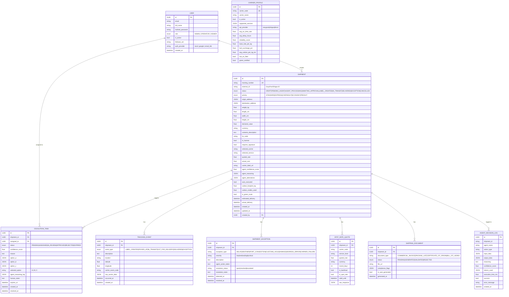

# Data Models — Entity Relationship Diagram

```mermaid
erDiagram
    USER {
        UUID id PK
        string email
        string full_name
        string hashed_password
        enum role "ADMIN | OPERATOR | VIEWER"
        bool is_active
        string firebase_uid
        string auth_provider "local | google | email_link"
        datetime created_at
    }

    SHIPMENT {
        UUID id PK
        string tracking_number UK
        string external_id "EasyPost/Shippo ID"
        enum status "DRAFT|PENDING_AGENT|AGENT_PROCESSING|AWAITING_APPROVAL|LABEL_CREATED|IN_TRANSIT|DELIVERED|EXCEPTION|CANCELLED"
        enum priority "STANDARD|EXPRESS|OVERNIGHT|ECONOMY|FREIGHT"
        JSON origin_address
        JSON destination_address
        float weight_kg
        float length_cm
        float width_cm
        float height_cm
        float declared_value
        string currency
        text contents_description
        string hs_code
        bool is_hazmat
        bool requires_signature
        string selected_carrier
        string selected_service
        float quoted_rate
        float actual_cost
        string carrier_label_url
        float agent_confidence_score
        JSON agent_reasoning
        JSON agent_alternatives
        bool auto_executed
        float carbon_footprint_kg
        float carbon_credits_used
        bool is_green_route
        datetime estimated_delivery
        datetime actual_delivery
        datetime created_at
        datetime updated_at
        UUID created_by FK
    }

    ESCALATION_TASK {
        UUID id PK
        UUID shipment_id FK
        UUID assigned_to FK
        enum status "PENDING|ASSIGNED|IN_REVIEW|APPROVED|REJECTED|EXPIRED"
        float confidence_score
        text reason
        JSON option_a
        JSON option_b
        JSON option_c
        string selected_option "A | B | C"
        JSON agent_reasoning_log
        text human_notes
        datetime expires_at
        datetime created_at
        datetime resolved_at
    }

    AGENT_DECISION_LOG {
        UUID id PK
        string shipment_id
        string agent_name
        string action_type
        JSON input_data
        JSON output_data
        text reasoning
        float confidence_score
        JSON tokens_used
        float execution_time_ms
        bool success
        string error_message
        datetime created_at
    }

    TRACKING_EVENT {
        UUID id PK
        UUID shipment_id FK
        enum event_type "LABEL_CREATED|PICKED_UP|IN_TRANSIT|OUT_FOR_DELIVERY|DELIVERED|EXCEPTION"
        text description
        string location
        float latitude
        float longitude
        string carrier_event_code
        JSON raw_carrier_data
        datetime occurred_at
        datetime created_at
    }

    SHIPMENT_EXCEPTION {
        UUID id PK
        UUID shipment_id FK
        string exception_type "DELAY|WEATHER|PORT_CONGESTION|CUSTOMS_HOLD|DAMAGE|ADDRESS_ERROR|CARRIER_FAILURE"
        string severity "low|medium|high|critical"
        text description
        text agent_action_taken
        string resolution_status "open|resolved|escalated"
        text resolution_notes
        datetime detected_at
        datetime resolved_at
    }

    CARRIER_PROFILE {
        UUID id PK
        string carrier_code UK
        string carrier_name
        bool is_active
        JSON supported_services
        string api_provider "easypost|shippo|direct"
        float avg_on_time_rate
        float avg_delay_hours
        float reliability_score
        float base_rate_per_kg
        float fuel_surcharge_pct
        float avg_carbon_per_kg_km
        bool has_ev_fleet
        bool green_certified
    }

    SPOT_RATE_QUOTE {
        UUID id PK
        UUID shipment_id FK
        string carrier_code
        string service_level
        float quoted_rate
        string currency
        int transit_days
        bool is_backhaul
        bool is_spot_rate
        datetime valid_until
        JSON raw_response
    }

    SHIPPING_DOCUMENT {
        UUID id PK
        UUID shipment_id FK
        string document_type "COMMERCIAL_INVOICE|PACKING_LIST|CERTIFICATE_OF_ORIGIN|BILL_OF_LADING"
        enum status "PENDING|GENERATED|VALIDATED|REJECTED"
        string file_url
        JSON compliance_flags
        bool is_auto_generated
        datetime generated_at
    }

    USER ||--o{ SHIPMENT : "creates"
    USER ||--o{ ESCALATION_TASK : "assigned to"
    SHIPMENT ||--o{ ESCALATION_TASK : "triggers"
    SHIPMENT ||--o{ TRACKING_EVENT : "has"
    SHIPMENT ||--o{ SHIPMENT_EXCEPTION : "has"
    SHIPMENT ||--o{ SPOT_RATE_QUOTE : "has"
    SHIPMENT ||--o{ SHIPPING_DOCUMENT : "has"
    SHIPMENT ||--o{ AGENT_DECISION_LOG : "logged in"
```
