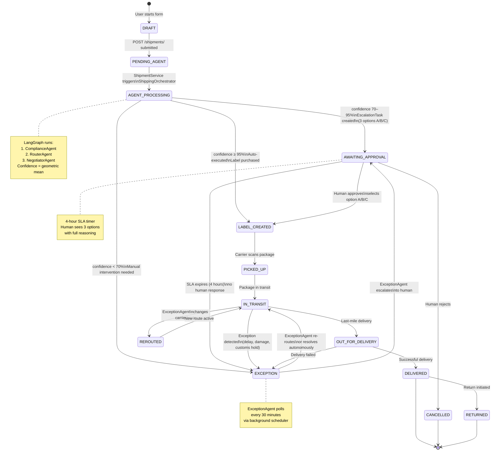

# Shipment Lifecycle — State Machine

```mermaid
stateDiagram-v2
    [*] --> DRAFT : User starts form

    DRAFT --> PENDING_AGENT : POST /shipments/ submitted

    PENDING_AGENT --> AGENT_PROCESSING : ShipmentService triggers\nShippingOrchestrator

    AGENT_PROCESSING --> AWAITING_APPROVAL : confidence 70–95%\nEscalationTask created\n(3 options A/B/C)

    AGENT_PROCESSING --> LABEL_CREATED : confidence ≥ 95%\nAuto-executed\nLabel purchased

    AGENT_PROCESSING --> EXCEPTION : confidence < 70%\nManual intervention needed

    AWAITING_APPROVAL --> LABEL_CREATED : Human approves\nselects option A/B/C

    AWAITING_APPROVAL --> CANCELLED : Human rejects

    AWAITING_APPROVAL --> EXCEPTION : SLA expires (4 hours)\nno human response

    LABEL_CREATED --> PICKED_UP : Carrier scans package

    PICKED_UP --> IN_TRANSIT : Package in transit

    IN_TRANSIT --> OUT_FOR_DELIVERY : Last-mile delivery

    IN_TRANSIT --> EXCEPTION : Exception detected\n(delay, damage, customs hold)

    EXCEPTION --> IN_TRANSIT : ExceptionAgent re-routes\nor resolves autonomously

    EXCEPTION --> AWAITING_APPROVAL : ExceptionAgent escalates\nto human

    OUT_FOR_DELIVERY --> DELIVERED : Successful delivery

    OUT_FOR_DELIVERY --> EXCEPTION : Delivery failed

    DELIVERED --> [*]

    CANCELLED --> [*]

    IN_TRANSIT --> REROUTED : ExceptionAgent\nchanges carrier/route

    REROUTED --> IN_TRANSIT : New route active

    DELIVERED --> RETURNED : Return initiated

    RETURNED --> [*]

    note right of AGENT_PROCESSING
        LangGraph runs:
        1. ComplianceAgent
        2. RouterAgent
        3. NegotiatorAgent
        Confidence = geometric mean
    end note

    note right of AWAITING_APPROVAL
        4-hour SLA timer
        Human sees 3 options
        with full reasoning
    end note

    note right of EXCEPTION
        ExceptionAgent polls
        every 30 minutes
        via background scheduler
    end note
```
