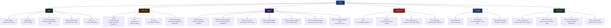

# API Routes Map

```mermaid
graph TD
    ROOT["/api/v1"]

    ROOT --> AUTH["/auth"]
    ROOT --> SHIPS["/shipments"]
    ROOT --> AGENTS["/agents"]
    ROOT --> ESC["/escalations"]
    ROOT --> TRACK["/tracking"]
    ROOT --> DOCS["/documents"]

    AUTH --> A1["POST /register\nCreate local account"]
    AUTH --> A2["POST /login\nLocal JWT login"]
    AUTH --> A3["POST /firebase/login\nExchange Firebase token → JWT"]
    AUTH --> A4["GET /firebase/config\nFirebase web config"]
    AUTH --> A5["GET /me\nCurrent user profile"]

    SHIPS --> S1["POST /\n🤖 Create shipment\n(triggers full agent workflow)"]
    SHIPS --> S2["GET /\nList shipments\n(filter by status)"]
    SHIPS --> S3["GET /{id}\nGet shipment details"]
    SHIPS --> S4["GET /{id}/reasoning\nFull agent reasoning log\n(audit trail)"]

    AGENTS --> AG1["POST /process\nRun full multi-agent workflow"]
    AGENTS --> AG2["POST /compliance/check\nRun ComplianceAgent standalone"]
    AGENTS --> AG3["POST /rates/quote\nGet real-time carrier rates"]
    AGENTS --> AG4["POST /rates/negotiate\nRun NegotiatorAgent"]
    AGENTS --> AG5["POST /exceptions/handle\nRun ExceptionAgent"]
    AGENTS --> AG6["POST /sustainability/carbon\nCalculate carbon footprint"]
    AGENTS --> AG7["POST /sustainability/green-routes\nFind green routes"]

    ESC --> E1["GET /\nList pending escalations"]
    ESC --> E2["GET /{id}\nGet escalation with 3 options"]
    ESC --> E3["POST /{id}/approve\nHuman selects option A/B/C"]
    ESC --> E4["POST /{id}/reject\nHuman rejects shipment"]

    TRACK --> T1["GET /{id}/events\nAll tracking events"]
    TRACK --> T2["GET /{id}/live\nLive tracking from carrier API"]
    TRACK --> T3["GET /{id}/exceptions\nDetected exceptions"]

    DOCS --> D1["POST /ocr/address\nExtract address from image"]
    DOCS --> D2["POST /ocr/invoice\nExtract invoice data from image"]
    DOCS --> D3["POST /ocr/package-scan\nAnalyze package dimensions"]
    DOCS --> D4["GET /shipment/{id}\nAll shipment documents"]

    style ROOT fill:#1e3a5f,stroke:#3b82f6,color:#fff
    style AUTH fill:#1a2e1a,stroke:#22c55e,color:#fff
    style SHIPS fill:#3d2000,stroke:#f59e0b,color:#fff
    style AGENTS fill:#2d1b4e,stroke:#a855f7,color:#fff
    style ESC fill:#7f1d1d,stroke:#f87171,color:#fff
    style TRACK fill:#1e3a5f,stroke:#60a5fa,color:#fff
    style DOCS fill:#1a2e1a,stroke:#4ade80,color:#fff
```
