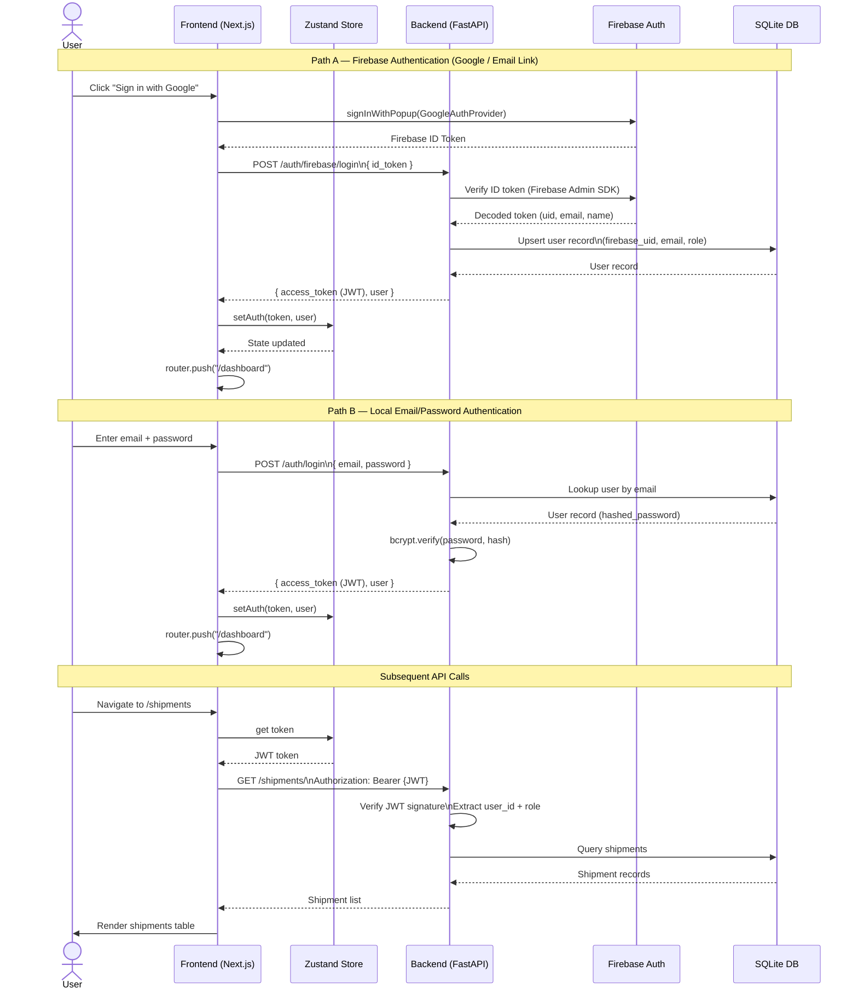

# Authentication Flow

```mermaid
sequenceDiagram
    actor User
    participant FE as Frontend (Next.js)
    participant STORE as Zustand Store
    participant BE as Backend (FastAPI)
    participant FB as Firebase Auth
    participant DB as SQLite DB

    Note over User,DB: Path A — Firebase Authentication (Google / Email Link)

    User->>FE: Click "Sign in with Google"
    FE->>FB: signInWithPopup(GoogleAuthProvider)
    FB-->>FE: Firebase ID Token
    FE->>BE: POST /auth/firebase/login\n{ id_token }
    BE->>FB: Verify ID token (Firebase Admin SDK)
    FB-->>BE: Decoded token (uid, email, name)
    BE->>DB: Upsert user record\n(firebase_uid, email, role)
    DB-->>BE: User record
    BE-->>FE: { access_token (JWT), user }
    FE->>STORE: setAuth(token, user)
    STORE-->>FE: State updated
    FE->>FE: router.push("/dashboard")

    Note over User,DB: Path B — Local Email/Password Authentication

    User->>FE: Enter email + password
    FE->>BE: POST /auth/login\n{ email, password }
    BE->>DB: Lookup user by email
    DB-->>BE: User record (hashed_password)
    BE->>BE: bcrypt.verify(password, hash)
    BE-->>FE: { access_token (JWT), user }
    FE->>STORE: setAuth(token, user)
    FE->>FE: router.push("/dashboard")

    Note over User,DB: Subsequent API Calls

    User->>FE: Navigate to /shipments
    FE->>STORE: get token
    STORE-->>FE: JWT token
    FE->>BE: GET /shipments/\nAuthorization: Bearer {JWT}
    BE->>BE: Verify JWT signature\nExtract user_id + role
    BE->>DB: Query shipments
    DB-->>BE: Shipment records
    BE-->>FE: Shipment list
    FE->>User: Render shipments table
```
