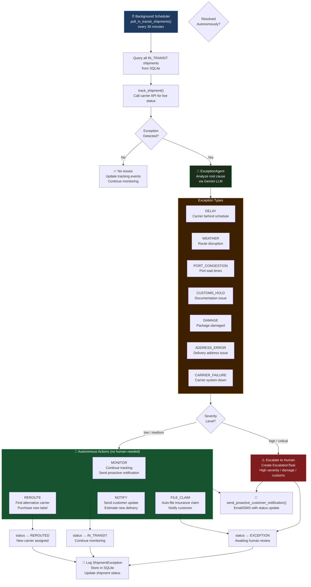

# Exception Handling & Self-Healing Flow

```mermaid
flowchart TD
    SCHED["⏰ Background Scheduler\npoll_in_transit_shipments()\nevery 30 minutes"]

    POLL["Query all IN_TRANSIT shipments\nfrom SQLite"]

    TRACK_API["track_shipment()\nCall carrier API for live status"]

    EXCEPTION_CHECK{"Exception\nDetected?"}

    NO_ISSUE["✅ No issues\nUpdate tracking events\nContinue monitoring"]

    EA["🤖 ExceptionAgent\nAnalyze root cause\nvia Gemini LLM"]

    subgraph EXCEPTION_TYPES["Exception Types"]
        EX1["DELAY\nCarrier behind schedule"]
        EX2["WEATHER\nRoute disruption"]
        EX3["PORT_CONGESTION\nPort wait times"]
        EX4["CUSTOMS_HOLD\nDocumentation issue"]
        EX5["DAMAGE\nPackage damaged"]
        EX6["ADDRESS_ERROR\nDelivery address issue"]
        EX7["CARRIER_FAILURE\nCarrier system down"]
    end

    SEVERITY{"Severity\nLevel?"}

    subgraph AUTONOMOUS_ACTIONS["🤖 Autonomous Actions (no human needed)"]
        ACT1["MONITOR\nContinue tracking\nSend proactive notification"]
        ACT2["REROUTE\nFind alternative carrier\nPurchase new label"]
        ACT3["FILE_CLAIM\nAuto-file insurance claim\nNotify customer"]
        ACT4["NOTIFY\nSend customer update\nEstimate new delivery"]
    end

    ESCALATE_HUMAN["⚠️ Escalate to Human\nCreate EscalationTask\nHigh severity / damage / customs"]

    NOTIFY_CUSTOMER["📧 send_proactive_customer_notification()\nEmail/SMS with status update"]

    LOG_EXCEPTION["📝 Log ShipmentException\nStore in SQLite\nUpdate shipment status"]

    RESOLVE{"Resolved\nAutonomously?"}

    STATUS_UPDATE_REROUTED["status → REROUTED\nNew carrier assigned"]
    STATUS_UPDATE_EXCEPTION["status → EXCEPTION\nAwaiting human review"]
    STATUS_UPDATE_INTRANSIT["status → IN_TRANSIT\nContinue monitoring"]

    SCHED --> POLL --> TRACK_API --> EXCEPTION_CHECK

    EXCEPTION_CHECK -->|"No"| NO_ISSUE
    EXCEPTION_CHECK -->|"Yes"| EA

    EA --> EXCEPTION_TYPES
    EXCEPTION_TYPES --> SEVERITY

    SEVERITY -->|"low / medium"| AUTONOMOUS_ACTIONS
    SEVERITY -->|"high / critical"| ESCALATE_HUMAN

    AUTONOMOUS_ACTIONS --> ACT1
    AUTONOMOUS_ACTIONS --> ACT2
    AUTONOMOUS_ACTIONS --> ACT3
    AUTONOMOUS_ACTIONS --> ACT4

    ACT2 --> STATUS_UPDATE_REROUTED
    ACT1 --> STATUS_UPDATE_INTRANSIT
    ACT3 --> STATUS_UPDATE_EXCEPTION
    ESCALATE_HUMAN --> STATUS_UPDATE_EXCEPTION

    AUTONOMOUS_ACTIONS --> NOTIFY_CUSTOMER
    ESCALATE_HUMAN --> NOTIFY_CUSTOMER

    STATUS_UPDATE_REROUTED --> LOG_EXCEPTION
    STATUS_UPDATE_INTRANSIT --> LOG_EXCEPTION
    STATUS_UPDATE_EXCEPTION --> LOG_EXCEPTION

    style SCHED fill:#1e3a5f,stroke:#3b82f6,color:#fff
    style EA fill:#1a2e1a,stroke:#22c55e,color:#fff
    style EXCEPTION_TYPES fill:#3d2000,stroke:#f59e0b,color:#fff
    style AUTONOMOUS_ACTIONS fill:#14532d,stroke:#4ade80,color:#fff
    style ESCALATE_HUMAN fill:#7f1d1d,stroke:#f87171,color:#fff
```
