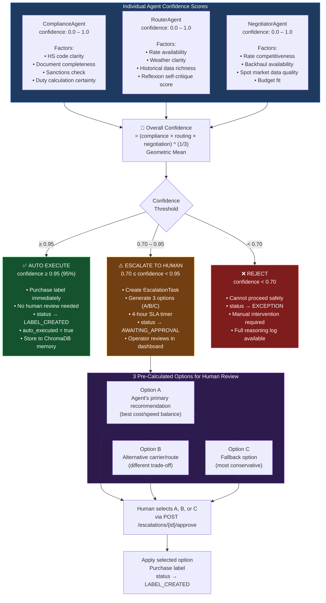

# Confidence Scoring & Disposition Logic

```mermaid
flowchart TD
    subgraph AGENT_SCORES["Individual Agent Confidence Scores"]
        CS["ComplianceAgent\nconfidence: 0.0 – 1.0\n\nFactors:\n• HS code clarity\n• Document completeness\n• Sanctions check\n• Duty calculation certainty"]
        RS["RouterAgent\nconfidence: 0.0 – 1.0\n\nFactors:\n• Rate availability\n• Weather clarity\n• Historical data richness\n• Reflexion self-critique score"]
        NS["NegotiatorAgent\nconfidence: 0.0 – 1.0\n\nFactors:\n• Rate competitiveness\n• Backhaul availability\n• Spot market data quality\n• Budget fit"]
    end

    FORMULA["📐 Overall Confidence\n= (compliance × routing × negotiation) ^ (1/3)\nGeometric Mean"]

    THRESHOLD{"Confidence\nThreshold"}

    AUTO["✅ AUTO EXECUTE\nconfidence ≥ 0.95 (95%)\n\n• Purchase label immediately\n• No human review needed\n• status → LABEL_CREATED\n• auto_executed = true\n• Store to ChromaDB memory"]

    ESCALATE["⚠️ ESCALATE TO HUMAN\n0.70 ≤ confidence < 0.95\n\n• Create EscalationTask\n• Generate 3 options (A/B/C)\n• 4-hour SLA timer\n• status → AWAITING_APPROVAL\n• Operator reviews in dashboard"]

    REJECT["❌ REJECT\nconfidence < 0.70\n\n• Cannot proceed safely\n• status → EXCEPTION\n• Manual intervention required\n• Full reasoning log available"]

    subgraph OPTIONS["3 Pre-Calculated Options for Human Review"]
        OPT_A["Option A\nAgent's primary recommendation\n(best cost/speed balance)"]
        OPT_B["Option B\nAlternative carrier/route\n(different trade-off)"]
        OPT_C["Option C\nFallback option\n(most conservative)"]
    end

    HUMAN_SELECT["Human selects A, B, or C\nvia POST /escalations/{id}/approve"]

    APPLY["Apply selected option\nPurchase label\nstatus → LABEL_CREATED"]

    CS --> FORMULA
    RS --> FORMULA
    NS --> FORMULA

    FORMULA --> THRESHOLD

    THRESHOLD -->|"≥ 0.95"| AUTO
    THRESHOLD -->|"0.70 – 0.95"| ESCALATE
    THRESHOLD -->|"< 0.70"| REJECT

    ESCALATE --> OPTIONS
    OPTIONS --> OPT_A
    OPTIONS --> OPT_B
    OPTIONS --> OPT_C

    OPT_A --> HUMAN_SELECT
    OPT_B --> HUMAN_SELECT
    OPT_C --> HUMAN_SELECT

    HUMAN_SELECT --> APPLY

    style AGENT_SCORES fill:#1e3a5f,stroke:#3b82f6,color:#fff
    style AUTO fill:#14532d,stroke:#4ade80,color:#fff
    style ESCALATE fill:#713f12,stroke:#fbbf24,color:#fff
    style REJECT fill:#7f1d1d,stroke:#f87171,color:#fff
    style OPTIONS fill:#2d1b4e,stroke:#a855f7,color:#fff
```
