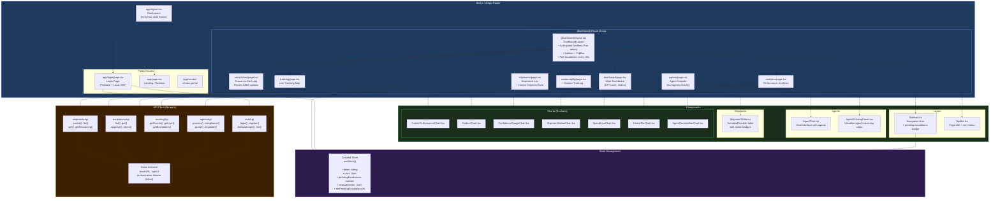

# Frontend Architecture — Next.js 14

```mermaid
graph TB
    subgraph NEXTJS["Next.js 14 App Router"]
        ROOT_LAYOUT["app/layout.tsx\nRootLayout\n(Inter font, dark theme)"]

        subgraph PUBLIC_ROUTES["Public Routes"]
            LOGIN["app/login/page.tsx\nLogin Page\n(Firebase + Local JWT)"]
            LANDING["app/page.tsx\nLanding / Redirect"]
            VENDOR["app/vendor/\nVendor portal"]
        end

        subgraph DASHBOARD_GROUP["(dashboard) Route Group"]
            DASH_LAYOUT["(dashboard)/layout.tsx\nDashboardLayout\n• Auth guard (redirect if no token)\n• Sidebar + TopBar\n• Poll escalations every 30s"]

            DASH["dashboard/page.tsx\nMain Dashboard\n(KPI cards, charts)"]
            SHIPS_PAGE["shipments/page.tsx\nShipments List\n+ Create Shipment form"]
            ESC_PAGE["escalations/page.tsx\nHuman-in-the-Loop\nReview A/B/C options"]
            TRACK_PAGE["tracking/page.tsx\nLive Tracking Map"]
            AGENT_PAGE["agents/page.tsx\nAgent Console\n(test agents directly)"]
            ANA_PAGE["analytics/page.tsx\nPerformance Analytics"]
            SUS_PAGE["sustainability/page.tsx\nCarbon Tracking"]
        end
    end

    subgraph COMPONENTS["Components"]
        subgraph LAYOUT_COMP["Layout"]
            SIDEBAR["Sidebar.tsx\nNavigation links\n+ pending escalations badge"]
            TOPBAR["TopBar.tsx\nPage title + user menu"]
        end

        subgraph AGENT_COMP["Agents"]
            AGENT_CHAT["AgentChat.tsx\nChat interface with agents"]
            AGENT_THINK["AgentThinkingPanel.tsx\nVisualize agent reasoning steps"]
        end

        subgraph SHIP_COMP["Shipments"]
            SHIP_TABLE["ShipmentTable.tsx\nSortable/filterable table\nwith status badges"]
        end

        subgraph CHART_COMP["Charts (Recharts)"]
            CH1["CarrierPerformanceChart.tsx"]
            CH2["CarbonChart.tsx"]
            CH3["ConfidenceGaugeChart.tsx"]
            CH4["ShipmentStatusChart.tsx"]
            CH5["SpendLineChart.tsx"]
            CH6["CarrierPieChart.tsx"]
            CH7["AgentDecisionBarChart.tsx"]
        end
    end

    subgraph STATE["State Management"]
        ZUSTAND["Zustand Store\nuseStore()\n\n• token: string\n• user: User\n• pendingEscalations: number\n• setAuth(token, user)\n• setPendingEscalations(n)"]
    end

    subgraph API_LIB["API Client (lib/api.ts)"]
        AXIOS["Axios Instance\nbaseURL: /api/v1\nAuthorization: Bearer {token}"]
        AUTH_API["authApi\n.login() .register()\n.firebaseLogin() .me()"]
        SHIP_API["shipmentsApi\n.create() .list()\n.get() .getReasoning()"]
        ESC_API["escalationsApi\n.list() .get()\n.approve() .reject()"]
        TRACK_API["trackingApi\n.getEvents() .getLive()\n.getExceptions()"]
        AGENT_API["agentsApi\n.process() .compliance()\n.quote() .negotiate()"]
    end

    %% Layout hierarchy
    ROOT_LAYOUT --> LOGIN
    ROOT_LAYOUT --> LANDING
    ROOT_LAYOUT --> DASH_LAYOUT
    DASH_LAYOUT --> DASH
    DASH_LAYOUT --> SHIPS_PAGE
    DASH_LAYOUT --> ESC_PAGE
    DASH_LAYOUT --> TRACK_PAGE
    DASH_LAYOUT --> AGENT_PAGE
    DASH_LAYOUT --> ANA_PAGE
    DASH_LAYOUT --> SUS_PAGE

    %% Layout uses components
    DASH_LAYOUT --> SIDEBAR
    DASH_LAYOUT --> TOPBAR

    %% Pages use components
    SHIPS_PAGE --> SHIP_TABLE
    AGENT_PAGE --> AGENT_CHAT
    AGENT_PAGE --> AGENT_THINK
    DASH --> CH4
    DASH --> CH1
    ANA_PAGE --> CH5
    ANA_PAGE --> CH6
    ANA_PAGE --> CH7
    SUS_PAGE --> CH2
    AGENT_PAGE --> CH3

    %% State
    DASH_LAYOUT --> ZUSTAND
    LOGIN --> ZUSTAND
    SIDEBAR --> ZUSTAND

    %% API
    SHIPS_PAGE --> SHIP_API
    ESC_PAGE --> ESC_API
    TRACK_PAGE --> TRACK_API
    AGENT_PAGE --> AGENT_API
    LOGIN --> AUTH_API
    DASH_LAYOUT --> ESC_API

    SHIP_API --> AXIOS
    ESC_API --> AXIOS
    TRACK_API --> AXIOS
    AGENT_API --> AXIOS
    AUTH_API --> AXIOS

    style NEXTJS fill:#1e3a5f,stroke:#3b82f6,color:#fff
    style COMPONENTS fill:#1a2e1a,stroke:#22c55e,color:#fff
    style STATE fill:#2d1b4e,stroke:#a855f7,color:#fff
    style API_LIB fill:#3d2000,stroke:#f59e0b,color:#fff
    style DASHBOARD_GROUP fill:#1e3a5f,stroke:#60a5fa,color:#fff
    style CHART_COMP fill:#1a2e1a,stroke:#4ade80,color:#fff
```
