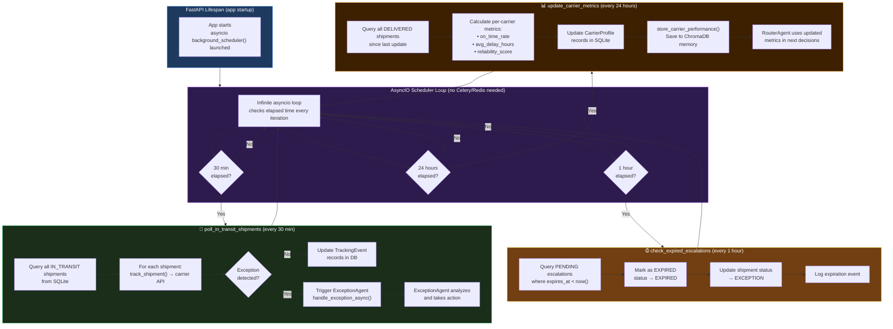

# Background Tasks & Scheduler

```mermaid
flowchart TD
    subgraph LIFESPAN["FastAPI Lifespan (app startup)"]
        STARTUP["App starts\nasyncio background_scheduler() launched"]
    end

    subgraph SCHEDULER["AsyncIO Scheduler Loop (no Celery/Redis needed)"]
        LOOP["Infinite asyncio loop\nchecks elapsed time every iteration"]

        T1_CHECK{"30 min\nelapsed?"}
        T2_CHECK{"1 hour\nelapsed?"}
        T3_CHECK{"24 hours\nelapsed?"}
    end

    subgraph TASK1["🚢 poll_in_transit_shipments (every 30 min)"]
        P1["Query all IN_TRANSIT shipments\nfrom SQLite"]
        P2["For each shipment:\ntrack_shipment() → carrier API"]
        P3{"Exception\ndetected?"}
        P4["Update TrackingEvent\nrecords in DB"]
        P5["Trigger ExceptionAgent\nhandle_exception_async()"]
        P6["ExceptionAgent analyzes\nand takes action"]
        P1 --> P2 --> P3
        P3 -->|"No"| P4
        P3 -->|"Yes"| P5 --> P6
    end

    subgraph TASK2["⏰ check_expired_escalations (every 1 hour)"]
        E1["Query PENDING escalations\nwhere expires_at < now()"]
        E2["Mark as EXPIRED\nstatus → EXPIRED"]
        E3["Update shipment status\n→ EXCEPTION"]
        E4["Log expiration event"]
        E1 --> E2 --> E3 --> E4
    end

    subgraph TASK3["📊 update_carrier_metrics (every 24 hours)"]
        M1["Query all DELIVERED shipments\nsince last update"]
        M2["Calculate per-carrier metrics:\n• on_time_rate\n• avg_delay_hours\n• reliability_score"]
        M3["Update CarrierProfile\nrecords in SQLite"]
        M4["store_carrier_performance()\nSave to ChromaDB memory"]
        M5["RouterAgent uses updated\nmetrics in next decisions"]
        M1 --> M2 --> M3 --> M4 --> M5
    end

    LIFESPAN --> SCHEDULER
    LOOP --> T1_CHECK
    LOOP --> T2_CHECK
    LOOP --> T3_CHECK

    T1_CHECK -->|"Yes"| TASK1
    T2_CHECK -->|"Yes"| TASK2
    T3_CHECK -->|"Yes"| TASK3

    T1_CHECK -->|"No"| LOOP
    T2_CHECK -->|"No"| LOOP
    T3_CHECK -->|"No"| LOOP

    TASK1 --> LOOP
    TASK2 --> LOOP
    TASK3 --> LOOP

    style LIFESPAN fill:#1e3a5f,stroke:#3b82f6,color:#fff
    style SCHEDULER fill:#2d1b4e,stroke:#a855f7,color:#fff
    style TASK1 fill:#1a2e1a,stroke:#22c55e,color:#fff
    style TASK2 fill:#713f12,stroke:#fbbf24,color:#fff
    style TASK3 fill:#3d2000,stroke:#f59e0b,color:#fff
```
