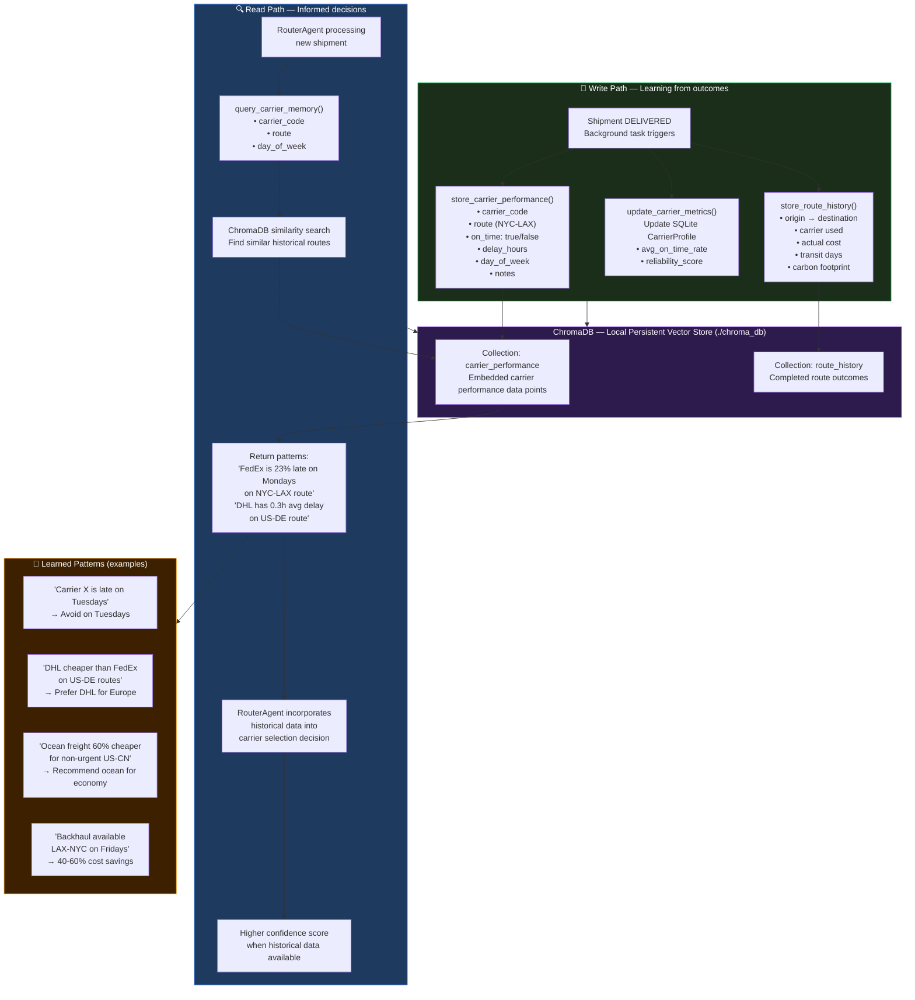

# Agent Memory & Long-Term Learning (ChromaDB)

```mermaid
flowchart TD
    subgraph CHROMA["ChromaDB — Local Persistent Vector Store (./chroma_db)"]
        COL1["Collection: carrier_performance\nEmbedded carrier performance data points"]
        COL2["Collection: route_history\nCompleted route outcomes"]
    end

    subgraph WRITE_PATH["📝 Write Path — Learning from outcomes"]
        W1["Shipment DELIVERED\nBackground task triggers"]
        W2["store_carrier_performance()\n• carrier_code\n• route (NYC-LAX)\n• on_time: true/false\n• delay_hours\n• day_of_week\n• notes"]
        W3["store_route_history()\n• origin → destination\n• carrier used\n• actual cost\n• transit days\n• carbon footprint"]
        W4["update_carrier_metrics()\nUpdate SQLite CarrierProfile\n• avg_on_time_rate\n• reliability_score"]
        W1 --> W2 --> COL1
        W1 --> W3 --> COL2
        W1 --> W4
    end

    subgraph READ_PATH["🔍 Read Path — Informed decisions"]
        R1["RouterAgent processing\nnew shipment"]
        R2["query_carrier_memory()\n• carrier_code\n• route\n• day_of_week"]
        R3["ChromaDB similarity search\nFind similar historical routes"]
        R4["Return patterns:\n'FedEx is 23% late on Mondays\non NYC-LAX route'\n'DHL has 0.3h avg delay\non US-DE route'"]
        R5["RouterAgent incorporates\nhistorical data into\ncarrier selection decision"]
        R6["Higher confidence score\nwhen historical data available"]
        R1 --> R2 --> R3 --> COL1
        COL1 --> R4 --> R5 --> R6
    end

    subgraph PATTERNS["🧠 Learned Patterns (examples)"]
        P1["'Carrier X is late on Tuesdays'\n→ Avoid on Tuesdays"]
        P2["'DHL cheaper than FedEx\non US-DE routes'\n→ Prefer DHL for Europe"]
        P3["'Ocean freight 60% cheaper\nfor non-urgent US-CN'\n→ Recommend ocean for economy"]
        P4["'Backhaul available\nLAX-NYC on Fridays'\n→ 40-60% cost savings"]
    end

    WRITE_PATH --> CHROMA
    READ_PATH --> CHROMA
    R4 --> PATTERNS

    style CHROMA fill:#2d1b4e,stroke:#a855f7,color:#fff
    style WRITE_PATH fill:#1a2e1a,stroke:#22c55e,color:#fff
    style READ_PATH fill:#1e3a5f,stroke:#3b82f6,color:#fff
    style PATTERNS fill:#3d2000,stroke:#f59e0b,color:#fff
```
